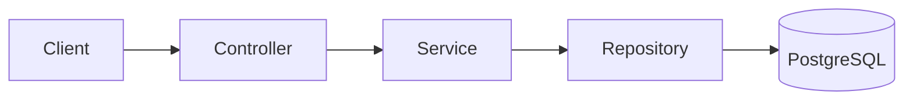

# Architecture

The API uses request/response DTOs. Services own uniqueness, date-range and salary-history rules; repositories provide filtered paging and database-side aggregate projections. `Employee` has a unidirectional collection of `Compensation` records to retain salary history without modelling payroll.

Flyway owns schema evolution. Controllers never return entities, and a controller advice creates a stable error shape.

Analytics are grouped by currency and annualize monthly compensation before calculating salary ranges, averages, and bands. No exchange-rate conversion is performed.
